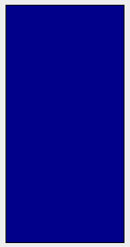

# Modeling the World

## Motivation

- Consider the following `barbell` method that creates a barbell:

~~~ scala
def barbell(load: Int, length: Int): Image = {
  val weight = Rectangle(load, 100) fillColor Color.black
  val bar = Rectangle(length, 20) fillColor Color.grey
  weight beside bar beside weight
}

val lightBarbell = barbell(10, 180)
val heavyBarbell = barbell(20, 200)
~~~

- You can’t do much with your barbells (excepted drawing them)

## Motivation (2)

- How to define a barbell heavier than a given barbell?

~~~ scala
def weigh(barbell: Image): Image = ???
~~~

> - Modeling barbells with images makes it hard to manipulate them

## Motivation (3)

- How to define a barbell heavier than a given barbell?

~~~ scala
def weighLoad(load: Int) = load + 10
def weighLength(length: Int) = length + 20

val lightBarbellLoad = 10
val lightBarbellLength = 180

val heavyBarbellLoad = weighLoad(lightBarbellLoad)
val heavyBarbellLength = weighLength(lightBarbellLength)
~~~

> - This approach is such a mess to use

## Case Class Definition

~~~ scala
case class Barbell(load: Int, length: Int) {
  def weigh: Barbell = Barbell(load + 10, length + 20)
}

val lightBarbell = Barbell(10, 180)
val heavyBarbell = lightBarbell.weigh
~~~

- This code contains a **case class definition** which introduces:
    - the `Barbell` **type**,
    - the `Barbell` **constructor**

## Case Class Definition (2)

~~~ scala
case class Barbell(load: Int, length: Int) {
  def weigh: Barbell = Barbell(load + 10, length + 20)
}

val lightBarbell = Barbell(10, 180)
val heavyBarbell = lightBarbell.weigh
~~~

- The `Barbell` type has three **members**: `load`, `length` and `weigh`
- `lightBarbell` and `heavyBarbell` are **instances** of `Barbell`

## Exercise

- Implement the following method:

~~~ scala
def barbellImage(barbell: Barbell): Image = ???
~~~

## Exercise

- Add a method `lighten` to the `Barbell` type

## Exercise

- A barbell is one possible fitness device
- Consider also a simple mat as another type of fitness device:

- A mat has a width and a length. Define a case class for it.

## Exercise

- Let’s assume that in your world a fitness device is either a mat or a barbell (and nothing else)
- Write a `fitnessDeviceImage` method that takes a fitness device as parameter and returns an image of it

## Variant Types

- How to model that a fitness device can either be a mat or be a barbell, and nothing else?

~~~ scala
sealed trait FitnessDevice
case class Barbell(load: Int, length: Int) extends FitnessDevice
case class Mat(width: Int, length: Int) extends FitnessDevice
~~~

- This code contains a **sealed trait definition**, which introduces the `FitnessDevice` type (but **no** constructor)
- Case class definitions that **extend** `FitnessDevice` define the possible **variants** of `FitnessDevice`
    - The variants of a sealed type must be defined within the same source file

## Pattern Matching

You can manipulate case classes and sealed types using **pattern matching**:

~~~ scala
def name(fitnessDevice: FitnessDevice): String = fitnessDevice match {
  case Barbell(load, length) => "Barbell"
  case Mat(width, length) => "Mat"
}
~~~

## Exercise

- Implement the following method:

~~~ scala
def fitnessDeviceImage(fitnessDevice: FitnessDevice): Image = ???
~~~

## Modeling the World

The combination of case classes and sealed trait gives a convenient way to model information in terms of **is** and **has** relationships:

- “a fitness device *is* a barbell *or* a mat”
    - `FitnessDevice` sealed trait extended by `Barbell` and `Mat`
- “a barbell *has* a load *and* a length”
    - `Barbell` case class with `load` and `length` members
- “a mat *has* a width *and* a length”
    - `Mat` case class with `width` and `length` members

## Exercise

- Model the following domain in Scala:
    - A geometric shape *is* a circle *or* a rectangle *or* a triangle,
    - A circle *has* a radius,
    - A rectangle *has* a width *and* a height,
    - A triangle *has* a width *and* a height.

## Exercise

- Model the following domain in Scala:
    - A course *has* a name *and* a difficulty level
    - A difficulty level *is* either “beginner”, “intermediate” *or* “advanced”

- Can you then define a course named “Programming in Scala” targetting beginners?

## Case Objects

~~~ scala
sealed trait DifficultyLevel
case class Beginner() extends DifficultyLevel
case class Intermediate() extends DifficultyLevel
case class Advanced() extends DifficultyLevel
~~~

If a case class has no parameter, just use a **case object** instead:

~~~ scala
sealed trait DifficultyLevel
case object Beginner extends DifficultyLevel
case object Intermediate extends DifficultyLevel
case object Advanced extends DifficultyLevel
~~~

## Exercise

- Model the following domain in Scala:
    - An expression is either a number or an addition
    - A number has a numeric value
    - An addition has a left-hand side expression and a right-hand side expression

## Syntax Summary

~~~ scala
case class <name>(<member1>, <member2>, …)
~~~

~~~ scala
sealed trait <name1>
case class <name2>(…) extends <name1>
case class <name3>(…) extends <name1>
…
~~~

~~~ scala
<expr> match {
  case <name2>(…) => <expr>
  case <name3>(…) => <expr>
}
~~~
