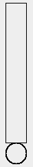
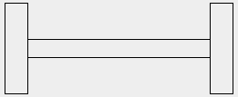
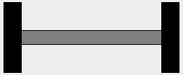
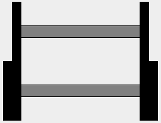
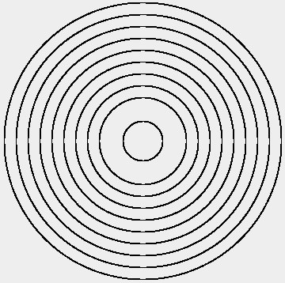

# Values and Types

## What is a program made of?

- A program is the **expression** of the solution of a given **problem**

- We need a way to define and refer to the elements of the **problem domain**

## The Simplest Program Elements: Literal Values

> What is “the answer to life the universe and everything”?

```scala
scala> 42
res0: Int = 42
```

> What is my name?

```scala
scala> "Julien"
res1: String = Julien
```

- `42` and `"Julien"` are **values** composed of a single **literal value**.

## Compound Values: Operators

> How many is three plus two?

```scala
scala> 3 + 2
res2: Int = 5
```

> What is the result of the concatenation of the texts “Hello ” and “world!”?

```scala
scala> "Hello " ++ "world!"
res3: String = Hello world!
```

- Values can be combined using **operators** to build more complex values.

## Compound Values: Method Calls

> What is the size of the text “Hello world!”?

```scala
scala> "Hello world!".size
res4: Int = 12
```

- **Methods** are **applied** on values using the **dot notation**.

> What is the range of numbers between 1 and 10?

```scala
scala> 1.to(10)
res5: scala.collection.immutable.Range.Inclusive = Range(1, 2, 3, 4, 5, 6, 7, 8, 9, 10)
```

- Methods can have **parameters**. They are supplied between parentheses.

## Operators Are Methods

Actually, operators are just methods with symbolic names:

```scala
scala> 3.+(2)
res6: Int = 5
```

The **infix syntax** can be used with non-symbolic methods too:

```scala
scala> 1 to 10
res7: scala.collection.immutable.Range.Inclusive = Range(1, 2, 3, 4, 5, 6, 7, 8, 9, 10)
```

- The **unification** of methods and operators makes the language simpler.

## Exercises

- Use the `abs` method to get the absolute value of `-42`.

- Use the `toUpperCase` method to get the text “Hello world!” in upper case.

## Raising the Abstraction Level: Non-Literal Values

Until now you worked essentially with numbers and text. But how to define things of a higher-level like **images**?

```scala
scala> Circle(42)
res8: doodle.core.Circle = Circle(42.0)
```

`Circle` is a **constructor** that takes one parameter (the radius) and returns a object representing a circle.

```scala
scala> Rectangle(30, 50)
res9: doodle.core.Rectangle = Rectangle(30.0, 50.0)
```

## Manipulating Images: Display and Layout

- Show an image with `draw`:

```scala
scala> draw(Rectangle(30, 50))

```

- Layout images by combining them using `beside`, `above` and `under`:

```scala
scala> Rectangle(60, 100) beside Circle(30)
res10: doodle.core.Image = Beside(Rectangle(60.0,100.0),Circle(30.0))

scala> draw(Rectangle(60, 100) beside Circle(30))

```

## Types

- All values have a **type**:
    - `42` has type `Int`,
    - `"foo"` has type `String`.


- Types **classify** values;
    - `0` and `42` are both `Int` values.

## Types Guide You

- Type checking forbids you to combine values in a wrong way:

```scala
scala> 1 to "10"
<console>:20: error: type mismatch;
 found   : String("10")
 required: Int
              1 to "10"
                   ^
```

- Program execution is a two steps process:
    - First, the compiler transforms your Scala code into JVM bytecode,
    - Second, the JVM runs the bytecode.
- Type checking happens during the first step: errors are detected early.

## Some Common Types

`Int`
: a 32-bit signed integer

`Double`
: a 64-bit IEEE-754 floating point number (e.g. `12.34`).

`Boolean`
: boolean values (`true` and `false`)

`String`
: text

## The Type Meaning the Absence of (Meaningful) Value

- Methods like `println` or `draw` return no meaningful value
- Instead, they perform some **side-effects**
- Their return type is `Unit`
- There is only one value of type `Unit`: `()`

## Exercise

- Draw an exclamation mark.



## Exercise

- Draw a barbell.



## Manipulating Images: Colors

Use `fillColor` to fill an image with a given color:

```scala
draw(Rectangle(30, 80) fillColor Color.black)
```

Examples of available colors are `red`, `blue`, `green`, `black`, `white`, `gray` and `brown`.

## Exercise

- Add colors to your barbell.



# Definitions

## Value Definitions

Consider the following program:

```scala
draw(
  (Rectangle(25, 100) fillColor Color.black) beside
  (Rectangle(200, 20) fillColor Color.grey) beside
  (Rectangle(25, 100) fillColor Color.black)
)
```

- It is hard to **read** because the expression is huge;
- It is hard to **maintain**: if you want to change the width of the weights you have to change the code at **two** places.

## Value Definitions (2)

```scala
val weight = Rectangle(25, 100) fillColor Color.black

val bar = Rectangle(200, 20) fillColor Color.grey

draw(weight beside bar beside weight)
```

- The first two lines are **value definitions**. They:
    - introduce new **names** (`weight` and `bar`),
    - **bind** them to the value at the right of “=”.

- Names can be used as any other value.

- Note that the type of definitions is **inferred** by the compiler.

## Value Definitions

Now, changing the weights requires to modify the code at one place only:

```scala
val weight = Rectangle(15, 100) fillColor Color.black

val bar = Rectangle(200, 20) fillColor Color.grey

draw(weight beside bar beside weight)
```

## Exercise

- Draw two barbells one above the other. The first one must have small weights, while the second one must have heavy weights.



## Method Definitions

Consider the following program:

```scala
val heavyWeight = Rectangle(30, 100) fillColor Color.black
val smallWeight = Rectangle(15, 100) fillColor Color.black
val bar = Rectangle(200, 20) fillColor Color.grey

val smallBarbell = smallWeight beside bar beside smallWeight
val heavyBarbell = heavyWeight beside bar beside heavyWeight

draw(smallBarbell above heavyBarbell)
```

Note the similarities between the `heavyWeight` and `smallWeight` definitions. How could you **generalize** them?

## Method Definitions (2)

```scala
def weight(width: Int) = Rectangle(width, 100) fillColor Color.black

val heavyWeight = weight(30)
val smallWeight = weight(15)
```

- The first line is a **method definition**. Contrary to value definitions, method definitions can have **parameters**.
- Parameters are specified between parentheses, separated by a comma.
- Parameter’s type must be explicitly given.

## Abstraction Principle

> Each significant piece of functionality in a program should be implemented in just one place in the source code.
>
> Where similar functions are carried out by distinct pieces of code, it is generally beneficial to combine them into one by **abstracting** out the varying parts.

Benjamin C. Pierce. *Types and Programming Languages*. MIT Press 2002.

## Exercise

- Define a method `barbell` that takes as parameter an image of a weight and returns an image of a barbell with this weight.

- Rewrite your previous program using the methods `barbell` and `weight`.

<!--
def barbell(weight: Image) =
  weight beside (Rectangle(200, 20) fillColor Color.grey) beside weight

def weight(width: Int) = Rectangle(width, 100) fillColor Color.black

val heavyBarbell = barbell(weight(30))
val smallBarbell = barbell(weight(15))

draw(smallBarbell above heavyBarbell)
-->

## Elements of Programming

- The programming language gives us ways to:
    - write literal values representing **simple elements** (`42`, `"Hello "`, etc.)
    - **combine** these values (using methods)
    - **abstract** over the value of expressions, by introducing a name to refer to an expression
        - These names can themselve abstract over parts of their definition, using parameters
- These means of abstraction and composition give you **expression power** to generalize programs and combine them

# Loops and Conditionals

## Exercise

- Draw five barbells stacked on top of each other.

## Loops and Conditionals

Consider the following program:

```scala
val unit = barbell(weight(15))
val barbell1 = unit
val barbell2 = unit above barbell1
val barbell3 = unit above barbell2
val barbell4 = unit above barbell3
val barbell5 = unit above barbell4
```

Note pattern: each $barbell_n$ value is built by putting a barbell above the $barbell_{n - 1}$ value. How to **generalize** this pattern?

## Loops and Conditionals

Basically, we want to express the following:

- $barbell_n =$
    - $unit$ if $n = 1$,
    - $unit$ $above$ $barbell_{n - 1}$ otherwise.

## Conditional Expressions

```scala
val unit = barbell(weight(15))
def barbells(n: Int) =
  if (n == 1) unit
  else unit above ???
```

- You can write **conditional expressions** using `if` and `else`
- The result of a conditional depends on the `Boolean` value of the condition

## Boolean Expressions

- Boolean literals: `true` and `false`
- Comparison operator: `42 == 42`, `42 != 0`, `42 > 0`
- Boolean expressions can be combined with `||` (disjonction), `&&` (conjonction), and `!` (negation)
    - `true || false == !false`

## Recursive Methods

```scala
val unit = barbell(weight(15))
def barbells(n: Int): Image =
  if (n == 1) unit
  else unit above barbells(n - 1)
```

- The return type of **recursive** methods is mandatory.

## Recursive Methods (2)

```scala
scala> barbells(3)
res11: doodle.core.Image = Above(…)
```

- What are the evaluation steps of the `barbells(3)` expression?

>   - Evaluation steps:
>
>     ```scala
>     barbells(3)
>     if (3 == 1) unit else unit above barbells(3 - 1)
>     unit above barbells(2)
>     unit above (if (2 == 1) unit else unit above barbells(2 - 1))
>     unit above (unit above barbells(1))
>     unit above (unit above (if (1 == 1) unit else unit above barbells(1 - 1)))
>     unit above (unit above unit)
>     ```

## Exercise

- Define a method `circles` that takes a number `n` as parameter and returns an image showing `n` concentric circles of increasing sizes.

~~~ scala
def circles(n: Int): Image = ???
~~~



<!--
def circles(n: Int): Image = {
  val circle = Circle(25 + 15 * n)
  if (n == 1) circle
  else circle on circles(n - 1)
}
-->

# Top-Level Definitions and Lexical Scopes

## Object Definition

- In Scala programs, methods and values must be defined within a top-level definition:

~~~ scala
object Loops {
  def circles(n: Int): Image = ???
}
~~~

- This code contains an **object definition**, which introduces the name `Loops`
- `Loops` refers to an **object** with one method, `circles`
- The method `circles` can be reached from the outside using the usual dot notation: `Loops.circles(42)`

## Packages

- Object definitions can be organized in **packages**:

~~~ scala
package core

object Loops { … }
~~~

~~~ scala
package std

object Lists { … }
~~~

## Packages Visibility

~~~ scala
package core

object Loops {
  def circles(n: Int): Image = ???
}
~~~

~~~ scala
package core

object Definitions {
  Loops.circles(42)
}
~~~

- Names located in a package are visible from code located in the same package

## Packages Visibility (2)

~~~ scala
package std

object Lists {
  core.Loops.circles(42)
}
~~~

- Names located in a package are not visible from code located in other packages
- These names must be **fully qualified** to be resolved by the compiler

## Imports

~~~ scala
package std

import core.Loops

object Lists {
  Loops.circles(42)
}
~~~

- **Import** clauses make names available without qualification

## Blocks and Local Definitions

~~~ scala
def barbells(n: Int): Image = {
  val unit = barbell(weight(15))
  if (n == 1) unit
  else unit above barbells(n - 1)
}
~~~

- Methods and values can also be defined within a **block**
- These local definitions are not visible from the outside of the block

## Exercise

- Define a method `spiral` that takes a number `n` as parameter and returns an image showing `n` circles of increasing sizes and laid out in a shape of spiral.


<!--
def spiral(n: Int): Image = {
  val size = 10 + n * 2
  val dist = 50 + n * 5
  val angle = Angle.degrees((n * 36) % 360)
  val circle = Circle(size).at(dist * angle.sin, dist * angle.cos)
  if (n == 1) circle else circle on spiral(n - 1)
}
-->

## Exercise

- Define a method `sierpinski` that takes a number `n` as parameter and returns an image showing the _Sierpinski triangle_ at `n` iterations:


<!--
def sierpinski(n: Int): Image = {
  if(n == 1) {
    Triangle(10, 10) fillColor Color.black
  } else {
    val smaller = sierpinski(n - 1)
    smaller above (smaller beside smaller)
  }
}
-->

# Syntax Summary

## Definitions

~~~ scala
object <name> {
  <statements>
}
~~~

~~~ scala
val <name> = <expr>
~~~

~~~ scala
def <name>(<p1>, <p2>, …) = <expr>
~~~

## Expressions

~~~ scala
if (<expr>) <expr> else <expr>
~~~

~~~ scala
<name>(<expr>, <expr>, …)
~~~

~~~ scala
<expr>.<name>(<expr>, …)
~~~

~~~ scala
{ <expr> ; … ; <expr> }
~~~

# Evaluation Model

## Evaluation Model

Consider the following program:

```scala
def foo = 1 + 1
val bar = 1 + 1
```

What is the difference between `foo` and `bar`?

> - The right hand side of `def`s is evaluated **each** time their name appear in an expression
>     - `foo` refers to the expression `1 + 1`
> - The right hand side of `val`s is evaluated **once**, at the definition site
>     - `bar` refers to the value `2`

## Termination

Is the evaluation process guaranteed to terminate?

```scala
def loop: Nothing = loop
```

<!--
## Linear and Tail Recursion

TODO
-->

# Higher-Order Functions and Function Literals

## Motivation

Consider the following solutions to the circles and spiral exercises:

```scala
def circles(n: Int): Image = {
  val circle = Circle(25 + 15 * n)
  if (n == 1) circle else circle on circles(n - 1)
}

def spiral(n: Int): Image = {
  val size = 10 + n * 2
  val dist = 50 + n * 5
  val angle = Angle.degrees((n * 36) % 360)
  val circle = Circle(size).at(dist * angle.sin, dist * angle.cos)
  if (n == 1) circle else circle on spiral(n - 1)
}
```

- Note the similarities between the last line of each method

## Motivation (2)

Here is an attempt to capture the loop and abstract over the images:

```scala
def stack(image: Image, n: Int): Image =
  if (n == 1) image else image on stack(image, n - 1)

def circles(count: Int) = stack(???, count)
```

> - We see that we can not supply the `image` parameter because it depends on the value of `n`
> - How to abstract over the **computation** that returns the image?

## Abstract Over Computations

```scala
def stack(image: Int => Image, n: Int): Image =
  if (n == 1) image(n) else image(n) on stack(n - 1)

def circles(count: Int) = stack(n => Circle(25 + 15 * n), count)
```

- The parameter `image` has type `Int => Image`, that is a **function** taking an `Int` and returning an `Image`
- We define `circles` by supplying a **function literal**

## Function Types and Function Values

- The type `(T1, …, Tn) => R` is the type of a function that takes `n` parameters (of type `T1`, …, `Tn`) and returns a value of type `R`
    - `Int => Int` is the type of a function that takes an `Int` and returns an `Int`

- The value `(t: T1, …, tn: Tn) => <expr>` is a function that takes `n` parameters (`t1`, …, `tn`) and which body is `<expr>`
    - `(a: Int, b: Int) => a + b` is a function that takes two parameters `a` and `b` and returns their sum

## Exercise

- Rewrite `spiral` using `stack`

<!--
def spiral(count: Int) = stack(n => {
  val size = 10 + n * 2
  val dist = 50 + n * 5
  val angle = Angle.degrees((n * 36) % 360)
  Circle(size).at(dist * angle.sin, dist * angle.cos)
}, count)
-->

## Exercise

- Note the similarities between `stack` and `barbells`. Abstract over their differences by defining the following `layout` method:

```scala
def layout(op: (Image, Image) => Image, image: Int => Image, n: Int): Image
```

So that `stack` and `barbells` can be rewritten as follows:

```scala
def stack(image: Int => Image, count: Int) =
  layout((img1, img2) => img1 on img2, image, count)

def barbells(count: Int) =
  layout((img1, img2) => img1 above img2, n => barbell(weight(15)), count)
```

<!--
def layout(op: (Image, Image) => Image, image: Int => Image, n: Int): Image =
  if (n == 1) image(n) else op(image(n), layout(op, image, n - 1))
-->

## Exercise

- Rewrite `sierpinski` using `layout`

<!--
def sierpinski(count: Int) =
  layout((img1, img2) => img2 above (img2 beside img2), n => Triangle(10, 10) fillColor Color.black, count)
-->

