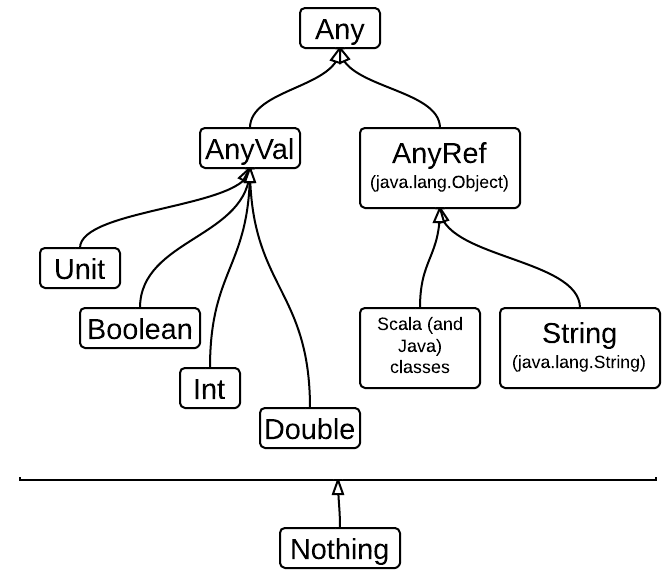

% Scala Course
% Julien Richard-Foy, Zenexity

# Overview

## Why Scala?

> A problem **well put** is **half solved**.

John Dewey


> A **scalable** programming language is one in which the **same** concepts can describe **small** as well as **large** parts.

Martin Odersky


## Scala in a Few Words

Scala is a **general purpose programming language**

Scala is **object oriented**

Scala is **statically typed**

Scala enables both **functional programming** and **imperative programming**

## Hello World

```scala
object Main extends App {
  println("Hello, World!")
}
```

## Flexible Syntax

```scala
"The 'Hello world' string" should {
  "contain 11 characters" in {
    "Hello world" must have size (11)
  }
}
```

```scala
class PingPong extends Actor {
  def receive = {
    case x => sender ! x
  }
}
```

```scala
class ExprParser extends RegexParsers {
  def factor = "[0-9]+".r | "("~expr~")"
  def term = factor~("*" | "/")~factor
  def expr = term~("+" | "-")~term
}
```


# Start programming

## Read-Eval-Print Loop

The quickest way to try Scala is to use the REPL (Read-Eval-Print-Loop)

```bash
$ scala
Welcome to Scala version 2.10.1 (Java HotSpot(TM) 64-Bit Server VM, Java 1.7.0_17).
Type in expressions to have them evaluated.
Type :help for more information.

scala>
```

(Check that [Scala](http://www.scala-lang.org) is installed on your system)


# Definitions and Evaluation

## What is a program made of?

- A program is the **expression** of the solution of a given **problem**

- We need a way to define and reference the elements of the **problem domain**

## The Simplest Program Elements

- What is “the answer to life the universe and everything”?

```scala
scala> 42
res0: Int = 42
```

- How much is three plus two?

```scala
scala> 3 + 2
res1: Int = 5
```

- What is the result of the concatenation of the texts “Hello ” and “world!”?

```scala
scala> "Hello " ++ "world!"
res2: String = Hello world!
```

## The Simplest Program Elements (2)

- What is the circumference of a circle with a radius of 10?

```scala
scala> 2 * 3.14159 * 10
res3: Double = 62.8318
```

- What is the area of the same circle?

```scala
scala> 3.14159 * 10 * 10
res4: Double = 314.159
```

> - *Hard-coded* values makes the program hard to **read** and to **maintain**

## Naming

- Hopefully we can define **names** to refer to values:

```scala
scala> val radius = 10
radius: Int = 10

scala> val pi = 3.14159
pi: Double = 3.14159

scala> val circumference = 2 * pi * radius
circumference: Double = 62.8318

scala> val area = pi * radius * radius
area: Double = 314.159
```

## Functions

- What is the circumference of *any* circle, given its radius?

```scala
def circumference(radius: Double) = 2 * pi * radius
```

- What is the area of *any* circle, given its radius?

```scala
def area(radius: Double) = pi * radius * radius
```

Usage:

```scala
scala> circumference(10)
res7: Double = 62.8318

scala> circumference(20)
res8: Double = 125.6636
```

> - By taking the radius as a parameter, the `circumference` function is more **general** than the previous version computing the circumference of circles with radius of 10 only

## Elements of Programming

- The programming language gives us ways to:

    - write literal expressions representing **simple elements** (`42`, `"Hello "`, etc.)

    - **combine** these expressions (using operators)

    - **abstract** over expressions, by introducing a name to refer to an expression

- These means of composition and abstraction give you **expression power** to generalize programs and combine them

## Abstraction Principle

> Each significant piece of functionality in a program should be implemented in just one place in the source code.
>
> Where similar functions are carried out by distinct pieces of code, it is generally beneficial to combine them into one by **abstracting** out the varying parts.

Benjamin C. Pierce, in Types and Programming Languages (2002)

## Exercises

* Write a function `square(x: Double): Double` that returns the square of `x`

```scala
scala> square(5)
res9: Double = 25.0
```

* Rewrite the `area` function using `square`

## Conditional and Boolean Expressions

- What is the absolute value of a number `x`?

```scala
def abs(x: Double) = if (x < 0) -x else x
```

- Boolean literals: `true` and `false`

- Boolean expressions can be combined with `||` (disjonction), `&&` (conjonction), `!` (negation) and the comparison operations (e.g. `==`)

    - `true || false == !false`

## Basic Types

Scala predefines some data types:

`Int`
: a 32-bit signed integer

`Double`
: a 64-bit IEEE-754 floating point number

`Boolean`
: boolean values (`true` or `false`)

`String`
: character strings

`Unit`
: absence of meaningful value

## Syntax Summary

### Definitions

- `val <name> = <expr>`

- `def <name>(<p1>, <p2>, …) = <expr>`

### Expressions

- `if (<expr>) <expr> else <expr>`

- `<name>(<expr>, <expr>, …)`

## Evaluation model

Consider the following program:

```scala
def foo = 1 + 1
val bar = 1 + 1
```

What is the difference between `foo` and `bar`?

> - The right hand side of `def`s is evaluated **each** time their name appear in an expression
>     - `foo` refers to the expression `1 + 1`
> - The right hand side of `val`s is evaluated **once**, at the definition site
>     - `bar` refers to the value `2`

## Recursive Functions

- What is the factorial of an integer `n`?

```scala
def fact(n: Int): Int =
  if (n <= 1) 1
  else n * fact(n - 1)
```

> - The return type of recursive functions can not be inferred, it must be explicit

## Functional Loops

```scala
scala> fact(4)
res9: Int = 24
```

- What are the evaluation steps of the `fact(4)` expression?

>   - Evaluation steps:
>
>     ```scala
>     fact(4)
>     if (4 <= 1) 1 else 4 * fact(4 - 1)
>     4 * fact(3)
>     4 * if (3 <= 1) 1 else 3 * fact(3 - 1)
>     4 * 3 * fact(2)
>     4 * 3 * if (2 <= 1) 1 else 2 * fact(2 - 1)
>     4 * 3 * 2 * fact(1)
>     4 * 3 * 2 * if (1 <= 1) 1 else 1 * fact(1 - 1)
>     4 * 3 * 2 * 1
>     12 * 2 * 1
>     24 * 1
>     24
>     ```

## Termination

Is the evaluation process guaranteed to terminate?

```scala
def loop: ??? = loop
```

<!--
## Linear and Tail Recursion

TODO
-->

## Exercise

* Write a function `fib(n: Int): Int` that returns the `n`^th^ element of the Fibonacci sequence.

> In the Fibonacci sequence of numbers, each number is the sum of the previous two numbers, starting with 0 and 1. This sequence begins with 0, 1, 1, 2, 3, 5, 8, 13, 21, 34, 55, 89, ...

```scala
scala> fib(0)
res10: Int = 0

scala> fib(1)
res11: Int = 1

scala> fib(2)
res12: Int = 1

scala> fib(3)
res13: Int = 2
```

## Exercise

* Write a function `sumInts(a: Int, b: Int): Int` that returns the sum of all the integers between `a` and `b`


# Making Real Programs

## Making an Executable Program from a Source File

- Write the following program in a file `Main.scala`:

```scala
object Main extends App {

  def fact(n: Int): Int =
    if (n <= 1) 1
    else n * fact(n - 1)

  println(fact(4))

}
```

## Making an Executable Program from a Source File (2)

- Compile it:

```bash
$ scalac Main.scala
```

- Run it:

```bash
$ scala Main
24
```

## Scaling the Build Process

- What if your program has 100 source files?

- How to recompile only the sources impacted by a given modification?

- What if my project depends on a third-party library?

- How to handle a whole project lifecycle (testing, packaging, publishing, etc.)?

## sbt

[sbt](http://www.scala-sbt.org/) is a build tool for Scala (and Java) projects

*sbt-ize* your project:

- Create a directory `my-project` for your project
- Move your `Main.scala` file into a `my-project/src/main/` directory
- Run it:
    - `$ sbt run` (from `my-project/` directory)
    - sbt automatically compiles the sources and calls the program entry point

## sbt Quick Start

- Run `$ sbt <command>` from your project directory to run an sbt command from your shell

- Run `$ sbt` from your project directory to open the sbt prompt

- Run sbt commands from the sbt prompt

    - `> run` to run your project
    - `> console` to open a Scala REPL in the context of your project
    - `> test` to run the tests of your project
    - `> compile` to compile your project (without running it)

## Using an Integrated Development Environment

Why use an IDE?

- syntax highlighting

- type information

- code navigation

- on-the-fly compilation

- code refactoring

## Eclipse and IntelliJ

### [Eclipse](http://www.eclipse.org)

- Install the [Eclipse Scala plugin](http://scala-ide.org/)

- Use the [sbt eclipse plugin](https://github.com/typesafehub/sbteclipse)

### [IntelliJ IDEA](http://www.jetbrains.com/idea/)

- Install the IntelliJ Scala plugin

- Use the [sbt idea plugin](https://github.com/mpeltonen/sbt-idea)

## Organizing your Code

- Organize your code in **packages**:

```scala
package myproject.business

object Fibonacci {
  def fib(n: Int) = …
}
```

```scala
package myproject.ui

object Fibonacci {
  def show(n: Int) = …
}
```

## Organizing your Code (2)

- Refer to a value by its *fully qualified name*:

```scala
myproject.business.Fibonacci.fib(6)
```

- Or **import** it:

```scala
import myproject.business.Fibonacci.fib
fib(6)
```


# Encapsulation and Abstract Data Types

## Exercise

### [Euler Problem #1](http://projecteuler.net/problem=1)

> If we list all the natural numbers below 10 that are multiples of 3 or 5, we get 3, 5, 6 and 9. The sum of these multiples is 23.
>
> Find the sum of all the multiples of 3 or 5 below 1000.

## Solution

```scala
def euler1: Int = loop(1, 0)

def isMultipleOf3Or5(n: Int) = n % 3 == 0 || n % 5 == 0

def loop(n: Int, sum: Int): Int =
  if (n < 1000) loop(n + 1, if (isMultipleOf3Or5(n)) sum + n else sum)
  else sum
```

> - the behavior of `loop` makes sense only for `euler1`
    - we don’t want **users** of `euler1` to rely on `loop`

## Blocks, Visibility and Encapsulation

- `isMultipleOf3Or5` and `loop` are **implementation** details for `euler1`

- We can hide them in a block:

```scala
def euler1 = {

  def isMultipleOf3Or5(n: Int) = n % 3 == 0 || n % 5 == 0

  def loop(n: Int, sum: Int): Int =
    if (n < 1000) loop(n + 1, if (isMultipleOf3Or5(n)) sum + n else sum)
    else sum

  loop(1, 0)
}
```

## Lexical Scoping

- Definitions of outer blocks are visible inside a block

- We can rewrite `euler1` as follows:

```scala
def euler1 = {

  def loop(n: Int, sum: Int): Int = {

    def isMultipleOf3Or5 = n % 3 == 0 || n % 5 == 0

    if (n < 1000) loop(n + 1, if (isMultipleOf3Or5) sum + n else sum)
    else sum
  }

  loop(1, 0)
}
```

## Modeling Complex Numbers

You want to design a program manipulating **complex numbers**

A complex number has a *real part* and an *imaginary part*, it can be expressed in the form *a + b **i***

Complex numbers can be added, substracted, multiplied, divided, etc.

## Modeling Complex Numbers (2)

To compute the product of two complex numbers, you could write the following functions:

```scala
def mulR(xR: Double, xI: Double, yR: Double, yI: Double) =
  xR * yR - xI * yI
def mulI(xR: Double, xI: Double, yR: Double, yI: Double) =
  xI * yR + xR * yI
```

And you could use them as follows:

```scala
val xR = 1; val xI = 2 // x = 1 + 2 i
val yR = 3; val yI = 4 // y = 3 + 4 i

val zR = mulR(xR, xI, yR, yI)
val zI = mulI(xR, xI, yR, yI)
```

> - Note how this design forces you to repeat things

> - Such a code would be very **error prone** and **hard to read and maintain**

## Abstract Data Types

You can capture the concept of a complex number into a **class**:

```scala
class Complex(a: Double, b: Double) {

  val real = a
  val imag = b

  def mul(that: Complex) =
    new Complex(
      this.real * that.real - this.imag * that.imag,
      this.imag * that.real + this.real * that.imag
    )
}
```

>   - Referring to a complex number requires only one symbol
>
>     ```scala
>     val x = new Complex(1, 2)
>     val y = new Complex(3, 4)
>     ```
>
>   - Multiplying two complex numbers requires only one operation
>
>     ```scala
>     val z = x.mul(y)
>     ```

## The `Complex` Class

- `Complex` is a **type**
- `Complex` is also a **constructor**
    - `a` and `b` are constructor parameters
    - New **objects** are created by calling the constructor prefixed by `new`
- `mul`, `real` and `imag` are **members** of the `Complex` type
    - Members can be selected with the syntax `<object>.<member>`
    - More precisely, `mul` is a **method** because it is a function member
- On the inside of a class, the name `this` refers to the object on which the code is called

## Exercise

* Add a `plus(that: Complex): Complex` method that adds two complex numbers

* Add a `pow(e: Int): Complex` method that raises a complex number to the power of `e`

## Polar Coordinates

Alternatively, a complex number could be represented using **polar coordinates**: *(r, &phi;)* where *r* is its *absolute value* and *&phi;* its *argument*

```scala
class Complex(r: Double, phi: Double) {

  val abs = r
  val arg = phi

  def mul(that: Complex) =
    new Complex(
      this.abs * that.abs,
      this.arg + that.arg
    )

}
```

## Data Abstraction

For users point of view, multiplying two complex numbers would be the same no matter which implementation is used:

```scala
z = x.mul(y)
```

How to abstract over the implementation of the `Complex` type?

## Abstract Classes and Members

```scala
abstract class Complex {
  def real: Double
  def imag: Double
  def abs: Double
  def arg: Double
  def mul(that: Complex): Complex
}
```

- `Complex` is an **abstract class**

- Its members are **abstract** (they have no body)

    - (Note that it could also have implemented members)

## Implementing an Abstract Class

```scala
class ComplexRectangular(a: Double, b: Double) extends Complex {

  val real = a
  val imag = b
  def abs = math.sqrt(a * a + b * b)
  def arg = math.atan2(a, b)

  def mul(that: Complex) =
    new Complex(
      this.real * that.real - this.imag * that.imag,
      this.imag * that.real + this.real * that.imag
    )
}
```

- `ComplexRectangular` **extends** (or **subclasses**) `Complex`
- `Complex` is a **superclass** of `ComplexRectangular`
- `ComplexRectangular` **implements** the abstract members of `Complex`

## Implementating an Abstract Class (2)

```scala
class ComplexPolar(r: Double, phi: Double) extends Complex {

  def real = r * math.cos(phi)
  def imag = r * math.sin(phi)
  val abs = r
  val arg = phi

  def mul(that: Complex) =
    new Complex(
      this.abs * that.abs,
      this.arg + that.arg
    )
}
```

## Dynamic Method Dispatch

Consider the following program:

```scala
def mulComplexes(x: Complex, y: Complex) = x.mul(y)
```

At runtime, the implementation of the concrete type of `x` (`ComplexRectangular` or `ComplexPolar`) is called

This process is named **dynamic method dispatch**

## Parameters vs. Abstract Members

Consider this part of the `ComplexRectangular` definition:

```scala
class ComplexRectangular(a: Double, b: Double) extends Complex {
  val real = a
  val imag = b
}
```

  - The `real` member implementation just aliases the `a` parameter (the same applies to `imag` and `b`)

>   - You can declare `real` and `imag` members in the class constructor parameters list:
>
>     ```scala
>     class ComplexRectangular(val real: Double, val imag: Double) extends Complex
>     ```
>
>   - Note that (currently) `def` members can not be declared as parameters

## Abstract Members, Encapsulation and Modularity

- Abstract members achieve **data abstraction**, that is a kind of encapsulation

- Encapsulation allows the construction of **abstraction layers**

- It is a key principle to achieve **modularity**: the underlying implementation can change without affecting users

## Specialization

`Complex` is more **general** than `ComplexRectangular` and `ComplexPolar`

You could also say that `ComplexRectangular` and `ComplexPolar` are more **specialized** than `Complex`

When specializing a type, you can:

- Implement abstract members
- Add new members
- Redefine non-abstract members

A subclass **conforms** to its superclass, so it can be used everywhere the superclass is needed

## Adding a Member to a Base Class

```scala
class SemiGroup {
  def append(a: Int, b: Int) = a + b
}

class Monoid extends SemiGroup {
  def zero = 0
}

class Group extends Monoid {
  def inverse(a: Int) = -a
}
```

## Redefining a Member of a Base Class

```scala
class LoggingSemiGroup extends SemiGroup {
  override def append(a: Int, b: Int) = {
    println(s"Calling append($a, $b)")
    super.append(a, b)
  }
}
```

- Redefine a member using `override`
- You can still refer to the base implementation using `super`

## Members Visibility

You can reduce the visibility of the members of a class:

```scala
abstract class Foo {
  private def foo = 42
  protected def bar: Int
}
```

- `private` members are not visible outside of the class definition

- `protected` members are not visible outside of the class definition except for subclasses

## Closing a Class Hierarchy

You can forbid the specialization of a class or of its members:

```scala
class Foo {
  final def foo = 42
}

final class Bar extends Foo
```

- `final` members can not be overriden

- `final` classes can not be extended

## Standard Class Hierarchy



## `Any`

`Any` is the superclass of all classes

It has at least two members that you should be aware of:

```scala
final def == (that: Any): Boolean
def equals(that: Any): Boolean
```

First, note that these members exist in this class mostly for compatibility reasons with the Java language

The `==` member allows you to compare any value with another value. It essentially delegates to `equals`

The default implementation of `equals` for classes compares the **references** `this` and `that`

## Overloading

Several members with the same name can coexist, as long their type signature is different

## Recursive Types

<!-- TODO Motivating problem -->

A **recursive type** is a data type that may contain values of the same type

They can encode data structures that can grow to arbitrary size (lists, trees, etc.)

Consider for example the following type `Ints` encoding an infinite stream of `Int` values:

```scala
abstract class Ints {
  def value: Int
  def next: Ints
}
```

```scala
def printSomeInts(ints: Ints) = {
  println(ints.value)
  println(ints.next.next.next.value)
}
```

## Recursive Types (2)

You can generate an infinite stream of zeros:

```scala
class Zeros extends Ints {
  val value = 0
  def next = new Zeros
}

printSomeInts(new Zeros) // prints “0”, “0”
```

## Recursive Types (3)

You can generate an infinite stream of successive numbers:

```scala
class Succs(val value: Int) extends Ints {
  def next = new Succs(value + 1)
}

printSomeInts(new Succs(0)) // prints “0”, “3”
```

## Exercise

Implement an abstract data type representing a sequence of integers of arbitrary size:

```scala
abstract class IntList {
  def add(n: Int): IntList
  def toString: String
}
```

The `toString` method should return `"Nil"` for the empty sequence, and `"1 :: 2 :: Nil"` for the sequence {1, 2}

> - Hint: consider to special case of an `IntList`: an empty list (`Nil`) and a list constructor (`Cons`) containing a head element and a tail list


# Higher-Order Functions and Function Literals

## Abstract Over Computations

### Exercise

* Add to `IntList` a method `sum: Int` that returns the sum of the elements of the list

* Then add a method `product: Int` that returns the product of the elements of the list

> * Note the strong **similarities** between `sum` and `product`

> * Can you write a more general function that could be reused to define `sum` and `product`?

> * TODO More on why it is difficult without higher-order functions

## Higher-Order Functions

- A function that takes another function as a parameter (or returns a function) is a **higher-order function**

- The type `(T1, …, Tn) => R` is the type of a function that takes `n` parameters (of type `T1`, …, `Tn`) and returns a value of type `R`
    - `Int => Int` is the type of a function that takes an `Int` and returns an `Int`

- The value `(t: T1, …, tn: Tn) => <expr>` is a function that takes `n` parameters (`t1`, …, `tn`) and which body is `<expr>`
    - `(a: Int, b: Int) => a + b` is a function that takes two parameters `a` and `b` and returns their sum

## Exercise

* Generalize `sum` and `product` by adding a method `fold(z: Int, op: (Int, Int) => Int): Int` that returns the application of the operation `op` to all the elements of the list (or `z` in the case of the empty list)
    * You should then be able to rewrite `sum` and `product` as follows:

        ```scala
        def sum = fold(0, (n, s) => s + n)
        def product = fold(1, (n, p) => p * n)
        ```

## Function Literals

In some cases, you’d like to avoid to repeat the parameter name of a literal function:

```scala
val inc: Int => Int = x => x + 1
```

You can use an underscore as a placeholder for the function parameter:

```scala
val inc: Int => Int = _ + 1
```

If the function takes several parameters, you can use as many underscores as parameters:

```scala
def sum = fold(0, _ + _)
def product = fold(1, _ * _)
```

## Currying and Partial Application

TODO


# Composition Mechanisms

## Functions Composition

Consider the following functions:

```scala
val length = (text: String) => text.length
val isEven = (n: Int) => n % 2 == 0
```

You can use them to define another function that tests if a text has an even length:

```scala
val hasEvenLength = (text: String) => isEven(length(text))
```

But a shorter way consists in writing that `hasEvenLength` is the composition of the functions `isEven` and `length`:

```scala
val hasEvenLength = isEven compose length
```

## Tuples

Classes can combine several values together

But sometimes you just want to aggregate values without defining additional methods

In such cases, defining an extra class would be cumbersome, you can use **tuples** instead:

```scala
def euclideanDiv(dividend: Int, divisor: Int): (Int, Int) = {
  val quotient = dividend / divisor
  val remainder = dividend % divisor
  (quotient, remainder)
}
```

> - The type `(T1, …, Tn)` is a tuple type of `n` elements which i^th^ element has type `Ti`
> - The value `(t1, …, tn)` is a tuple value of `n` elements

## Tuples (2)

```scala
val qr = euclideanDiv(42, 10)
println(qr._1)
println(qr._2)
```

> - Get the i^th^ element of a tuple with the member `_i`

```scala
val (q, r) = euclideanDiv(42, 10)
```

> - Or use a **tuple pattern** to *deconstruct* a tuple

## Components

You also saw how to implement a set of features in a single component using classes

Is it possible to build a larger system by combining small components together?

For instance, given the following class definitions:

```scala
class Adding {
  def add(a: Int, b: Int) = a + b
}
```

```scala
class Multiplying {
  def mul(a: Int, b: Int) = a * b
}
```

How to build calculator from these two components?

## Traits

**Traits** can encapsulate members and can be mixed together

```scala
trait Adding {
  def add(a: Int, b: Int) = a + b
}

trait Multiplying {
  def mul(a: Int, b: Int) = a * b
}

trait Calculator extends Adding with Multiplying
```

> - A trait definition is like a class definition, except that traits can not have constructor parameters
> - Traits can be mixed in another trait using `extends` or `with`

## Traits and Dynamic Dispatch

TODO


# String Interpolation

## String Interpolation

TODO


# Type Polymorphism

## Type Polymorphism

Until now, you saw only how to abstract over values

It is also possible to abstract over **types**

## Exercise

<!-- FIXME Use `identity(n: Int): Int`, `identity(b: Boolean): Boolean` as an example? -->

* Add a method `forAll(p: Int => Boolean): Boolean` to `IntList`, that tests if the predicate `p` holds for all the elements of the list

* Then add a method `hasEvenSize: Boolean` that tests if the list has an even size

* Generalize `forAll` and `hasEvenSize` by adding a method `foldBool(z: Boolean, op: (Int, Boolean) => Boolean): Boolean`

> * Note that the implementations of `fold` and `foldBool` are **exactly the same**.

> * Is it possible to write only one `fold` function that would work with both `Int` and `Boolean`?

## Polymorphic Functions

Look at the type signatures of `fold` and `foldBool`:

```scala
(Int,     (Int, Int)     => Int)     => Int
(Boolean, (Int, Boolean) => Boolean) => Boolean
```

You could add a `foldString` with the following type signature:

```scala
(String,  (Int, String)  => String)  => String
```

It always follows this pattern:

```scala
(A, (Int, A) => A) => A
```

## Polymorphic Functions (2)

Functions can have **type parameters**:

```scala
def fold[A](z: A, op: (Int, A) => A): A
```

- `A` is a **type parameter** (**universally** quantified), `fold` is a **polymorphic function**

You can then call `fold` as follows:

```scala
def sum = fold[Int](0, (n, s) => s + n)
def forAll(p: Int => Boolean) = fold[Boolean](true, (n, b) => b && p(n))
```

>   - Note that if you use the following signature you can help the type inference mechanism and omit the result type in most cases:
>
>     ```scala
>     def fold[A](z: A)(op: (Int, A) => A): A
>     ```
>
>     ```scala
>     def sum = fold(0)((n, s) => s + n)
>     ```

## Exercise

* Make `fold` polymorphic

* Rewrite `sum`, `product`, `forAll` and `hasEvenSize` in terms of `fold`

## Exercise

* Implement an abstract data type representing a list of `String` elements:

```scala
abstract class StringList {
  def add(str: String): StringList
  def toString: String
}
```

> - Note the strong similarities with `IntList`
> - You want to abstract over the type of the elements of the list

## Type Constructors

Types can have type parameters:

```scala
abstract class List[A] {
  def add(element: A): List[A]
  def toString: String
}
```

> - `List` is a **type constructor**: it takes a type as parameter and yields another type
>     - E.g. `List[Int]`, `List[String]`, etc.

## Exercise

* Write a polymorphic `List[A]` data type:

```scala
abstract class List[A] {
  def add(element: A): List[A]
  def fold[B](z: B)(op: (A, B) => B): B
  def toString: String
}
```

## Type Quantification

Subtyping and universal types are two different mechanisms that let you write more general programs. Can you mix them together?

Consider the following class hierarchy:

```scala
trait Animal {
  def fitness: Int
}

trait Reptile extends Animal

trait Mammal extends Animal

trait Zebra extends Mammal {
  def zebraCount: Int
}

trait Giraffe extends Mammal
```

You want to write a function `selection`, that takes two animals as parameters and returns the one with the highest `fitness` value. What will its type signature be?

## Type Quantification (2)

A possible solution using subtyping is the following:

```scala
def selection(a1: Animal, a2: Animal) =
  if (a1.fitness > a2.fitness) a1 else a2
```

What is the problem with this solution?

>   - The return type is `Animal`: call it with two `Zebra`s and you get only an `Animal`
>       - You loose the ability to access further its `zebraCount` member

## Type Quantification (3)

We could try to solve this issue using a universal type:

```scala
def selection[A](a1: A, a2: A): A =
  if (a1.fitness > a2.fitness) a1 else a2
```

But this solution does not compile: we can not access to the `fitness` member of `a1` and `a2` because `A` is not constrained to be a subtype of `Animal`

## Type Quantification (4)

### Upper Bound

We can write a better solution using a **bounded quantification**:

```scala
def selection[A <: Animal](a1: A, a2: A): A =
   if (a1.fitness > a2.fitness) a1 else a2
```

- `A <: Animal` means “for all type `A` that is a subtype of `Animal`”, and we say that `Animal` is the **upper bound** of `A`

### Lower Bound

Similarly, you can constraint a type parameter `A` to have a **lower bound** `B`:

 - `A >: B`

## Variance

Consider the following type modeling a zoo run containing an animal:

```scala
abstract class Run[A] {
  def get: A // Get the animal that lives in this run
}
```

Mammal well being is a serious subject, the following function checks that a given run has the appropriate size regarding to the animal that lives in (provided you have methods in `Run[A]` and `Mammal` that give you their size):

```scala
def isLargeEnough(run: Run[Mammal]): Boolean = …
```

What happens if you pass it a `Run[Zebra]` as parameter?

## Variance (2)

```scala
scala> isLargeEnough(zebraRun)
<console>:14: error: type mismatch;
 found   : Run[Zebra]
 required: Run[Mammal]
```

A `Run[Zebra]` is not a subtype of `Run[Mammal]`, in fact they are just two different types without any subtyping relation. Could it be otherwise? Should it be otherwise?

> - Intuitively, a run with a zebra is just a special case of a run with a mammal
> - `isLargeEnough` can only use the `get` member of its `Run[Mammal]` parameter, and expects to get a `Mammal` value
> - A `Run[Zebra]` value has a `get` member that returns a `Zebra`, which is a `Mammal`
> - It seems that `Run[Zebra]` should be a subtype of `Run[Mammal]`

## Covariance

More generally, `Run[A] <: Run[B]` if `A <: B`

We say that `A` is **covariant** in `Run[A]` and we can tell it to the compiler as follows:

```scala
abstract class Run[+A] {
  def get: A
}
```

Now the compiler accepts that you pass a `Run[Zebra]` where a `Run[Mammal]` is expected

## Variance (3)

Consider the following type modeling a veterinary able to treat animals:

```scala
abstract class Vet[A] {
  def treat(a: A)
}
```

And the following function treating all the mammals of the zoo using a veterinary passed as parameter:

```scala
def treatMammals(vet: Vet[Mammal]) { … }
```

What happens if you pass it a `Vet[Animal]` as parameter?

## Variance (4)

```scala
scala> treatMammals(animalVet)
<console>:14: error: type mismatch;
 found   : Vet[Animal]
 required: Vet[Mammal]
```

A `Vet[Animal]` is not a subtype of `Vet[Mammal]`, they are just two different types. Should it be otherwise?

> - Intuitively, a veterinary that can treat animals can treat mammals, because a mammal is just a special case of an animal
> - `treatMammals` can only use the `treat` member of its `Vet[Mammal]` parameter, and can pass it any `Mammal` value
> - A `Vet[Animal]` has a `treat` member that takes an `Animal` as parameter, so it can take a `Mammal` as well, because `Mammal` is a subtype of `Animal`
> - It seems that `Vet[Animal]` should be a subtype of `Vet[Mammal]`

## Contravariance

More generally, `Vet[A] <: Vet[B]` if `A >: B`

We say that `A` is **contravariant** in `Run[A]` and we can tell it to the compiler as follows:

```scala
abstract class Vet[-A] {
  def treat(a: A)
}
```

Now the compiler accepts that you pass a `Vet[Animal]` where a `Vet[Mammal]` is expected

## Variance (5)

For a type constructor `F[X]`, variance annotations allow you to define the subtyping relation of a types `F[A]` and `F[B]` according to the subtyping relation of the types `A` and `B`

By default, type parameters are **invariant**

## Exercise

* Make the `List` class covariant

* An empty list of `Int` and an empty list of `String` could be represented by a same value. What would be its type? Define such a value, call it `Nil`


# Object Orientation

## Every Value is an Object

Scala is a pure object-oriented language

Every value is an object

The type of each value is a class

## Functions are Objects

### Definition

```scala
trait Function[-T, +R] {
  def apply(parameter: T): R
}
```

The `Int => String` type is a shorthand for the `Function[Int, String]` type

The `(x: Int) => x + 1` expression is a shorthand for the following expression:

```scala
new Function[Int, Int] {
  def apply(x: Int) = x + 1
}
```

## Functions are Objects (2)

### Application

`f(t1, t2, …)` is a shorthand for `f.apply(t1, t2, …)`

- Note that the underlying value does not need to extend `Function`, it only needs to have an `apply` method

## Infix Notation for Methods

Methods with one parameter can be used like **infix operators**:

```scala
xs add 3 // Equivalent to “xs.add(3)”
```

This is especially convenient when methods have symbolic names:

```scala
1 + 2 // Equivalent to “1.+(2)”
```

> - How is the expression `1 + 2 * 3` parenthesized?
>     - `((1 + 2) * 3)` or `(1 + (2 * 3))`?

## Operators Precedence Rules

Operators **precedence** depends on their **first character** and is given by the following list (highest first):

- all special characters (excepted those below)
- `*` `/` `%`
- `+` `-`
- `:`
- `=` `!`
- `<` `>`
- `&`
- `^`
- `|`
- all letters

## Operators Associativity Rules

Consider the following expression building the sequence $\{1, 2\}$:

```scala
empty[Int] add 2 add 1
```

Because lists are constructed by “pushing” elements in front, the result of this expression will be a list whose **first** element is `1`

However, in the above expression this element appears in **last** position, which is not intuitive

You would like to write an expression looking like the following, instead:

```scala
1 add 2 add empty[Int]
```

## Operators Associativity Rules (2)

Operators **associativity** depends on their **last character**

By default they are **left-associative**: `empty[Int] add 2 add 1` is parenthesized as `(empty[Int] add 2) add 1`

If the operator name ends with character `:` or `=`, it becomes **right-associative**

If the `add` member was renamed to `::` you could write the following expression:

```scala
1 :: 2 :: empty[Int]
```

This expression would be parenthesized as `1 :: (2 :: empty[Int])`

## Symbolic vs Alphanumeric Names

Consider the two equivalent programs:

```scala
empty[Int] add 2 add 1
```

```scala
1 :: 2 :: empty[Int]
```

Symbolic names can make the code **more readable** by differentiating names referring to values and names referring to operators

Symbolic names can make the code **less readable** because they may be less meaningful than alphanumeric names

## Singleton Objects

Creating an object requires calling a constructor prefixed with the `new` keyword

<!-- TODO More on the motivation -->

Alternatively, you can define **singleton objects**:

```scala
object MyObject {
  val foo = 42
}
```

`MyObject` is a value of type `MyObject.type` that can be used as follows:

```scala
println(MyObject.foo)
```

## Top-Level Definitions

Singleton objects and classes (or traits) are the only allowed top-level definitions

Any other definition (`val`, `def`) must be nested within a top-level definition

## Companion Objects

An object definition with the same name as a class and declared in the same file is called a **companion object** for this class

A class and its companion object can access each other’s private members

Companion objects are a good place to define functions related to their companion class (e.g. factory methods)

## Exercise

* Add the alias `++` for the `concat` member of `List`

* Add the alias `::` for the `add` member of `List`

* Make `Nil` a singleton object


# Algebraic Data Types

## Structural Identity

Consider the following REPL session:

```scala
scala> 1 :: 2 :: List.empty[Int] == 1 :: 2 :: List.empty[Int]
res0: Boolean = false

scala> 1 == 1
res1: Boolean = true
```

In the first expression we are comparing two different **instances**, that’s why we get `false`

But is there a good reason to return `false`?

## A Type as a Space of Possible Values

Until now, we thought of types as a **programmation interface**: a list of available members for a given type name

E.g. type `Complex` has a `real` member

Alternatively, you can think of types as **sets of possible values**

- type `Boolean` has two possible values: `true` and `false`
- a type `State` with three possible values: `Sleeping`, `Eating` and `Working`
- type `Int` has 2^32^ possible values

Then, you can **combine** these sets to create new sets of values

## Product Types

What are the possible values of a type aggregating a `Boolean` value **and** a `State` value?

`Boolean` `State`
--------- ----------
`true`    `Sleeping`
`true`    `Eating`
`true`    `Working`
`false`   `Sleeping`
`false`   `Eating`
`false`   `Working`

The number of values is equal to the **product** of the number of values of the `Boolean` and the `State` types

## Sum Types

What are the possible values of a type containing either a `Boolean` value **or** a `State` value?

`Boolean` `State`
--------- -------
`true`
`false`
          `Sleeping`
          `Eating`
          `Working`

The number of values is equal to the **sum** of the number of values of the `Boolean` and the `State` types

## Algebraic Data Types

**Algebraic data types** are defined as *sums* or *products* of other types

A type is essentially a set of possible values

In that case, it makes sense to assume that two instances of a type are the same if they represent the same value in the set of possible values

## Defining `List` as an Algebraic Data Type

A list is either:

- an empty list, `Nil` ;

- a *constructor*, `Cons(head, tail)`, containing a `head` element and a `tail` list (which is a `List` itself)

## Encoding Algebraic Data Types

**case classes** turn regular classes into **product types**:

```scala
case class Person(isMarried: Boolean, state: State)
```

- Constructor parameters become members (as if they were prefixed with `val`)
- An `equals` implementation is generated, performing structural comparison
    - `new Person(true, Working) == new Person(true, Working)`
- A companion object with an `apply` member matching the class constructor parameters is automatically generated
    - You can omit the `new` keyword to create an instance: `Person(true, Working)`
- A `copy` member is also automatically generated
    - `Person(true, Working).copy(state = Sleeping)`

## Encoding Algebraic Data Types (2)

**sealed classes** and **inheritance** encode **sum types**:

```scala
sealed abstract class Person
case class SuperHero(isSavingTheWorld: Boolean) extends Person
case class Human(state: State) extends Person
```

- A `case class` can not be extended
- A `sealed class` can not be extended, except if the subclass is defined in the same source file
- A `Person` can either be a `SuperHero` or a `Human`, but nothing else

The `State` type could be implemented as follows:

```scala
sealed abstract class State
case object Sleeping extends State
case object Eating extends State
case object Working extends State
```

## Pattern Matching

**Pattern matching** can be used to deconstruct algebraic data types:

```scala
def isBusy(person: Person) = person match {
  case SuperHero(isSavingTheWorld) =>
    isSavingTheWorld
  case Human(state) =>
    state == Working
}
```

## Exercise

* Make `List` an algebraic data type

## Pattern Matching vs Fold

Consider the following programs:

```scala
def sum(xs: List[Int]) = xs match {
  case Nil => 0
  case Cons(x, xs) => x + sum(xs)
}
```

```scala
def sum(xs: List[Int]) =
  xs.fold(0)((x, s) => x + s)
```

- `fold` was your poor man’s pattern matching mechanism

## Algebraic Data Types and Data Abstraction

Should you use algebraic data types or regular classes?

- Algebraic data types are **closed types** (they can not be extended), but this characteristic is what makes it easier to add new operations on a type hierarchy

- Classes are **open types** (they can be extended), but you can not add a new operation on a class hierarchy without changing the whole hierarchy


# Failure Handling

## Option

Say you want to add a `head` member to your `List[A]` type, that returns the first element of a list

What should you return in the case of the empty list?

## Either, Try, `try`/`catch`/`throw`


# Standard Collections

## Standard Collections

The Scala standard library provides several types making it easier to deal with collections of elements

This section gives a slight overview of the standard collections. For more details see the [API documentation](http://scala-lang.org/api)

## `Traversable`

The most general one is `Traversable[A]`, it provides methods to iterate on the elements of a collection, to transform a collection, to filter it, and a lot more:

Method           Description
----------       -------------
`xs.foreach(f)`  Applies the function `f` to every element of `xs`
`xs ++ ys`       The concatenation of the elements of `xs` and `ys`
`xs.size`        The number of elements in `xs`
`xs.map(f)`      A collection obtained from applying `f` to every element of `xs`
`xs.filter(p)`   A collection obtained from filtering elements of `xs` that satisfy the predicate `p`
`xs.take(n)`     A collection containing the `n` first elements of `xs`
`xs.find(p)`     An optional value containing the first element of `xs` that satisfies `p`
`xs.headOption`  An optional value containing the first element of `xs`
`xs.tailOption`  An optional value containing the tail of `xs`

## `Iterable`

`Iterable[A]` extends `Traversable[A]`, here are some of its new members:

Method             Description
-----------        -------------
`xs.iterator`      An `Iterator[A]` over the elements of `xs`
`xs.grouped(n)`    An iterator that yields fixed-size chunks of `xs`
`xs zip ys`        An iterable of pairs of corresponding elements of `xs` and `ys`
`xs.zipWithIndex`  An iterable of pairs of elements of `xs` with their indices

## `Seq`

`Seq[A]` is an `Iterable[A]` which order of elements is deterministic. It adds the following members:

Method               Description
----------           ---------------
`x +: xs`            A collection with the elements of `xs` prepended with `x`
`xs :+ x`            A collection with the elements of `xs` followed by `x`
`xs.get(n)`          An optional value containing the `n`^th^ element of `xs` (0 indicates the first element)
`xs.reverse`         A collection with the elements of `xs` in reverse order
`xs.updated(n, x)`   A copy of `xs` which `n`^th^ element has been replaced by `x`
`xs.sorted`          A collection with the elements of `xs` sorted

## `List` and `Vector`

`List[A]` and `Vector[A]` are two implementations of `Seq[A]` with different performance characteristics:

- `List[A]` has more efficient `head` and `tail` implementations

- `Vector[A]` has more efficient `get` and `size` implementations

- If you want to do random access, you should use `Vector[A]`

```scala
val xs = 1 :: 2 :: 3 :: Nil // List
val ys = Vector(1, 2, 3)
```

## `Set`

A `Set[A]` is an `Iterable[A]` that contains no duplicate elements. It adds the following members:

Method               Description
-----------          ----------------
`xs + x`             A set containing the elements of `xs` and `x`
`xs - x`             A set containing the elements of `xs` without `x`
`xs.contains(x)`     Tests if `x` is contained in `xs`
`xs & ys`            Intersection of `xs` and `ys`
`xs | ys`            Union of `xs` and `ys`
`xs.subsetOf(ys)`    Tests if `xs` is a subset of `ys`

```scala
val xs = Set(1, 2, 3)
```

## `Map`

A `Map[A, B]` is an `Iterable[(A, B)]` that contains `B` values indexed by `A` values. It adds the following members:

Method               Description
-------------        ---------------
`xs.get(k)`          An optional value containing the value associated with `k`
`xs + (k -> x)`      Adds a new value `x` associated with `k`
`xs - k`             Removes the element associated with `k`
`xs.keys`            An iterable of the keys of `xs`

```scala
val xs = Map("foo" -> 42, "bar" -> 10, "baz" -> 0)
```


# Assignment, Immutability

## Motivating Problem

```scala
trait Foo {
  def bar: Int = …
}
```

`bar` triggers a heavy computation. You want to write a `CachedFoo` that caches the result of `bar` for a little time:

```scala
trait CachedFoo extends Foo {
  override def bar = ???
}
```

## `var`

## Identity and State

## Pros and Cons

## Immutability When Possible

> Classes should be immutable unless there's a very good reason to make them mutable....If a class cannot be made immutable, limit its mutability as much as possible.

Joshua Bloch


# `for` Notation

## ???


# Typeclasses, Implicit Parameters

## ???

Extensibility


# Named Parameters and Default Parameters


# Lazy vals and By-Name Parameters

## By-Name Parameters

Remember the evaluation strategy for parameters?


# Type Members

## `type`

## Type Projection

## Path-Dependent Types

## Summary of Scala Abstraction Mechanisms

+--------+-------------------------+-----------------------+
|        | Parameters              | Members               |
+========+=========================+=======================+
| Values | ```scala                | ```scala              |
|        | def f(x: Int): Int =    | def f(x: Int): Int    |
|        |   x + 1                 | ```                   |
|        | ```                     |                       |
|        |                         | ```scala              |
|        |                         | val x: Int            |
|        |                         | ```                   |
+--------+-------------------------+-----------------------+
| Types  | ```scala                | ```scala              |
|        | def g[A](a: A): A = a   | type List             |
|        | ```                     | ```                   |
|        |                         |                       |
|        | ```scala                |                       |
|        | trait Ordering[A] { … } |                       |
|        | ```                     |                       |
+--------+-------------------------+-----------------------+


# Testing

## Property-Based Testing

# References

This course is heavily inspired from the following books and courses:

- [Structure and Interpretation of Computer Programs](http://mitpress.mit.edu/sicp), by Harold Abelson, Gerald Jay Sussman and Julie Sussman

- [Programming and Principles](http://lamp.epfl.ch/teaching/progp), by Martin Odersky

- [Types and Programming Languages](http://www.cis.upenn.edu/~bcpierce/tapl/), by Benjamin Pierce

- [Practical Foundations for Programming Languages](http://www.cs.cmu.edu/~rwh/plbook/book.pdf), by Robert Harper
