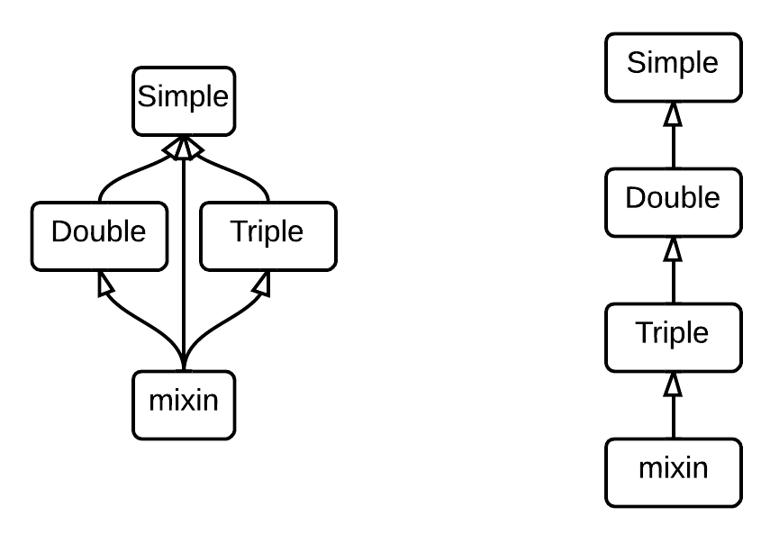

# Extensibility and Modularity

## Polar Coordinates

Alternatively, a complex number could be represented using **polar coordinates**: *(r, &phi;)* where *r* is its *absolute value* and *&phi;* its *argument*

```scala
class Complex(r: Double, phi: Double) {

  val abs = r
  val arg = phi

  def mul(that: Complex) =
    new Complex(
      this.abs * that.abs,
      this.arg + that.arg
    )

}
```

## Data Abstraction

For users point of view, multiplying two complex numbers would be the same no matter which implementation is used:

```scala
z = x.mul(y)
```

How to abstract over the implementation of the `Complex` type?

## Abstract Classes and Members

```scala
abstract class Complex {
  def real: Double
  def imag: Double
  def abs: Double
  def arg: Double
  def mul(that: Complex): Complex
}
```

- `Complex` is an **abstract class**

- Its members are **abstract** (they have no body)

    - (Note that it could also have implemented members)

## Implementing an Abstract Class

```scala
class ComplexRectangular(a: Double, b: Double) extends Complex {

  val real = a
  val imag = b
  def abs = math.sqrt(a * a + b * b)
  def arg = math.atan2(a, b)

  def mul(that: Complex) =
    new Complex(
      this.real * that.real - this.imag * that.imag,
      this.imag * that.real + this.real * that.imag
    )
}
```

- `ComplexRectangular` **extends** (or **subclasses**) `Complex`
- `Complex` is a **superclass** of `ComplexRectangular`
- `ComplexRectangular` **implements** the abstract members of `Complex`

## Implementing an Abstract Class (2)

```scala
class ComplexPolar(r: Double, phi: Double) extends Complex {

  def real = r * math.cos(phi)
  def imag = r * math.sin(phi)
  val abs = r
  val arg = phi

  def mul(that: Complex) =
    new Complex(
      this.abs * that.abs,
      this.arg + that.arg
    )
}
```

## Dynamic Method Dispatch

Consider the following program:

```scala
def mulComplexes(x: Complex, y: Complex) = x.mul(y)
```

At runtime, the implementation of the concrete type of `x` (`ComplexRectangular` or `ComplexPolar`) is called

This process is named **dynamic method dispatch**

## Parameters vs. Abstract Members

Consider this part of the `ComplexRectangular` definition:

```scala
class ComplexRectangular(a: Double, b: Double) extends Complex {
  val real = a
  val imag = b
}
```

  - The `real` member implementation just aliases the `a` parameter (the same applies to `imag` and `b`)

>   - You can declare `real` and `imag` members in the class constructor parameters list:
>
>     ```scala
>     class ComplexRectangular(val real: Double, val imag: Double) extends Complex
>     ```
>
>   - Note that `def` members can not be declared as parameters

## Abstract Members, Encapsulation and Modularity

- Abstract members achieve encapsulation *via* **data abstraction**

- Encapsulation allows the construction of **abstraction layers**

- It is a key principle to achieve **modularity**: the underlying implementation can change without affecting users

## Specialization

`Complex` is more **general** than `ComplexRectangular` and `ComplexPolar`

You could also say that `ComplexRectangular` and `ComplexPolar` are more **specialized** than `Complex`

When specializing a type, you can:

- Implement abstract members
- Add new members
- Redefine non-abstract members

A subclass **conforms** to its superclass, so it can be used everywhere the superclass is needed

## Adding a Member to a Base Class

```scala
class SemiGroup {
  def append(a: Int, b: Int) = a + b
}

class Monoid extends SemiGroup {
  def zero = 0
}

class Group extends Monoid {
  def inverse(a: Int) = -a
}
```

## Redefining a Member of a Base Class

```scala
class LoggingSemiGroup extends SemiGroup {
  override def append(a: Int, b: Int) = {
    println(s"Calling append($a, $b)")
    super.append(a, b)
  }
}
```

- Redefine a member using `override`
- You can still refer to the base implementation using `super`

## Members Visibility

You can reduce the visibility of the members of a class:

```scala
abstract class Foo {
  private def foo = 42
  protected def bar: Int
}
```

- `private` members are not visible outside of the class definition

- `protected` members are not visible outside of the class definition except for subclasses

## Closing a Class Hierarchy

You can forbid the specialization of a class or of its members:

```scala
class Foo {
  final def foo = 42
}

final class Bar extends Foo
```

- `final` members can not be overriden

- `final` classes can not be extended

## Overloading

Several members with the same name can coexist, as long their type signature is different:

```scala
def add(that: Complex): Complex = …
def add(real: Double): Complex = add(new Complex(real, 0)
```

## Components

You saw how to implement a set of features in a single component using classes

Is it possible to build a larger system by combining small components together?

For instance, given the following class definitions:

```scala
class Adding {
  def add(a: Int, b: Int) = a + b
}
```

```scala
class Multiplying {
  def mul(a: Int, b: Int) = a * b
}
```

How to build calculator from these two components?

## Traits

**Traits** can encapsulate members and can be mixed together

```scala
trait Adding {
  def add(a: Int, b: Int) = a + b
}

trait Multiplying {
  def mul(a: Int, b: Int) = a * b
}

trait Calculator extends Adding with Multiplying
```

> - A trait definition is like a class definition, except that **traits can not have constructor parameters**
> - Traits can have abstract members
> - Traits can be mixed in another trait using `extends` and `with`

## Traits and Dynamic Dispatch

```scala
trait Simple {
  def value = 7
}

trait Double extends Simple {
  override def value = super.value * 2
}

trait Triple extends Simple {
  override def value = super.value * 3
}
```

```scala
val mixin = new Simple with Double with Triple
println(mixin.value) // What is printed?
```

Which implementation of the `value` member is called?

## Traits and Dynamic Dispatch (2)



